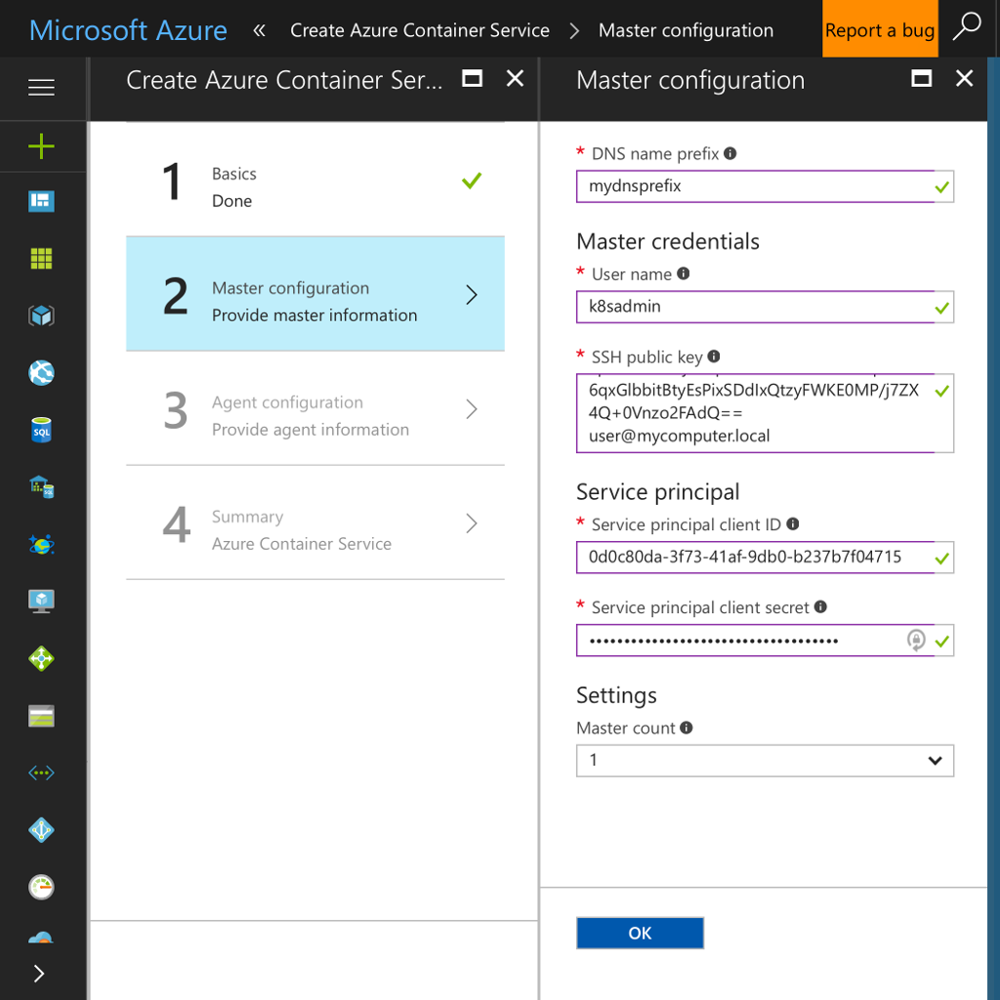

# Booting Azure Container Service

If you do not already have a Azure Cloud account, you can start a trial with $200 of free credit [here](https://azure.microsoft.com/en-us/free/). After completing sign up, you must add your billing information.

## Install and configure the Azure CLI

The Azure CLI (2.0) provides the `az` command and allows you to interact with Azure through the command line. Install the CLI by following the instructions on [GitHub for the Azure CLI](https://github.com/Azure/azure-cli).

After installing the CLI, log in to your Azure Account:
```
~ $ az login
To sign in, use a web browser to open the page https://aka.ms/devicelogin and enter the code F7DLMNOPE to authenticate.
[
  {
    "cloudName": "AzureCloud",
    "id": "57849302-a9f0-4908-b300-31337a0fb205",
    "isDefault": true,
    "name": "Azure Subscription",
    "state": "Enabled",
    "tenantId": "591acccc-dddd-4620-8f21-dbbeeeefee21",
    "user": {
      "name": "jhansen@deis.com",
      "type": "user"
    }
  }
]
```

TODO: handle multiple subscriptions?

## Create an Azure Service Principle

Next, create an Azure Service Principle that will be used to provision the ACS Kubernetes Cluster. Service Principles are entities that have permission to create resources on your behalf. New Service Principles must be given a unique name, a role, and an Azure subscription that the Service Principle may modify.

```
$ az ad sp create-for-rbac --name="http://workflow-on-acs" --role="Contributor" --scopes="/subscriptions/<SUBSCRIPTION ID>"
{
  "appId": "58b21231-3dd7-4546-bd37-9df88812331f",
  "name": "http://workflow-on-acs",
  "password": "349d4728-438a-52a5-ad25-a740aa0bd240",
  "tenant": "891a9ddc-477a-4620-8f21-db22ffd3ffea"
}
```

## Create Your ACS Kubernetes Cluster

Sign into the [Azure Portal](https://portal.azure.com) and create a new Azure Container Service:


Select "Resource Manager" for the deployment model:


Provide basic settings for your Kubernetes cluster.

* User name: this is the unix user name that will be added to all master and worker nodes
* SSH public key: provide a public key that will be associated with the user name specified above
* Subscription: choose the Azure Subscription that will be charged for your compute resources
* Resource group: create a new resource group and give the group a unique name
* Location: choose an Azure location for your cluster

When you have filled out the information, click "Ok".


The next step takes the Service Principle name and password generated using the Azure CLI.

* Service Priciple Client ID: the name of the principle created above e.g. `http://workflow-on-acs`
* Service Priciple Client Secret: the password returned by the Azure CLI e.g. 349d4728-438a-52a5-ad25-a740aa0bd240



Next, configure the number of worker nodes, the node size, and DNS prefix for your cluster.

Worker nodes should have at least 7GB of available RAM.

Click "Ok" to continue.


Review the cluster configuration and click "Ok". After clicking "Purchase" on the next screen you will be returned to the Azure Portal dashboard.


The Kubernetes cluster will take a few minutes to complete provisioning and configure itself. To monitor the progress of the deployment select the "Resource Group" from the nav on the left, then select the cluster name:


Path 2: ACS Engine

## Connect to your Kubernetes Cluster

1. Find hostname for the master
2. SCP Kubeconfig from master into place
3. Set KUBECONFIG environment value

```
$ kubectl cluster-info
Kubernetes master is running at https://slack-acs-1mgmt.eastus.cloudapp.azure.com
Heapster is running at https://slack-acs-1mgmt.eastus.cloudapp.azure.com/api/v1/proxy/namespaces/kube-system/services/heapster
KubeDNS is running at https://slack-acs-1mgmt.eastus.cloudapp.azure.com/api/v1/proxy/namespaces/kube-system/services/kube-dns
kubernetes-dashboard is running at https://slack-acs-1mgmt.eastus.cloudapp.azure.com/api/v1/proxy/namespaces/kube-system/services/kubernetes-dashboard
```

You are now ready to [install Deis Workflow](install-azure-acs.md)
