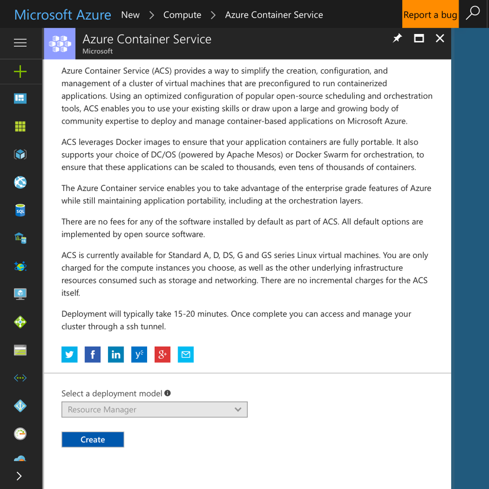
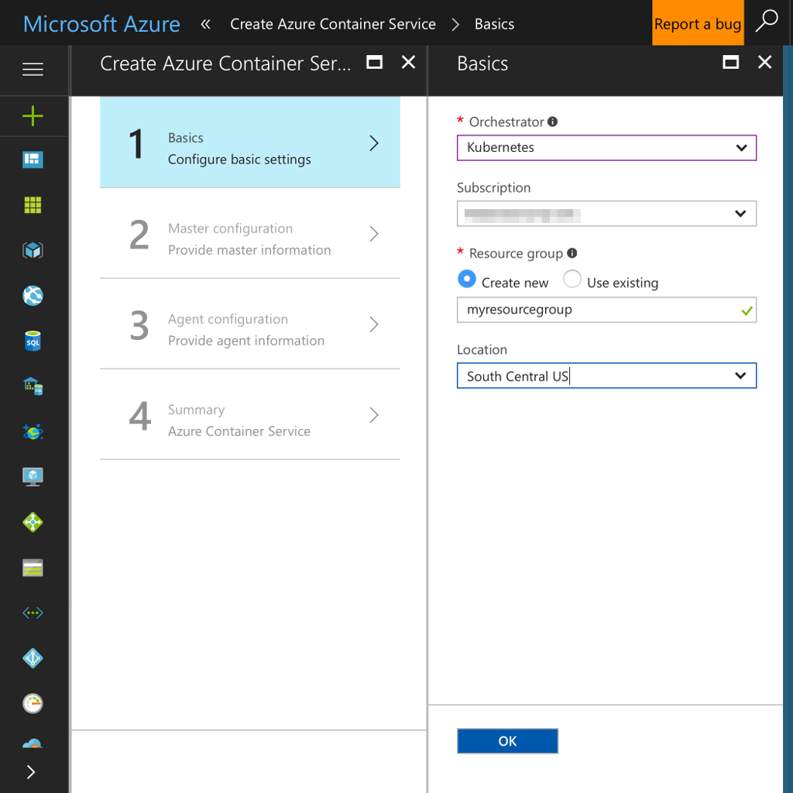
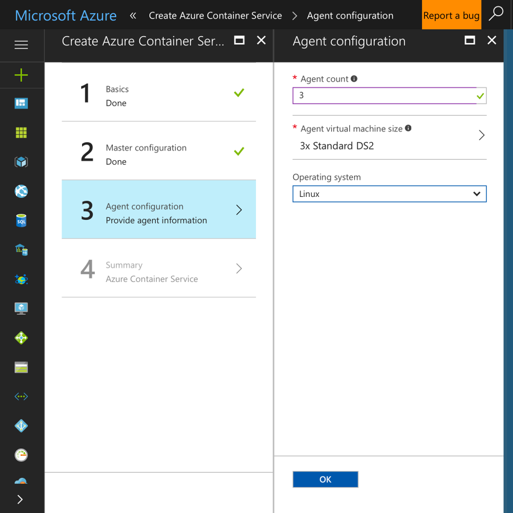

# Booting Azure Container Service

## Prerequisites

1. Azure Accout - If you do not already have a Azure Cloud account, you can start a trial with $200 of free credit [here](https://azure.microsoft.com/en-us/free/). After completing sign up, you must add your billing information.
2. Some form of *nix-based terminal - MacOS, Ubuntu, CentOS, Bash on Windows, etc
<br>Where the following is present:
3. Azure CLI - The Azure CLI (2.0) provides the `az` command and allows you to interact with Azure through the command line. Install the CLI by following the instructions on [GitHub for the Azure CLI](https://github.com/Azure/azure-cli).
4. SSH Key - This is used to deploy the cluster. [This URL helps to create SSH keys compatible with Linux VMs on Azure](https://docs.microsoft.com/azure/virtual-machines/virtual-machines-linux-mac-create-ssh-keys)
5. jq - to parse the JSON responses from the CLI. [jq download page](https://stedolan.github.io/jq/)

## Configure the Azure CLI

After installing the CLI, log in to your Azure Account by typing `az login` and output would look similar to this:
```
~ $ az login
To sign in, use a web browser to open the page https://aka.ms/devicelogin and enter the code F7DLMNOPE to authenticate.
[
  {
    "cloudName": "AzureCloud",
    "id": "57849302-a9f0-4908-b300-31337a0fb205",
    "isDefault": true,
    "name": "Azure Subscription",
    "state": "Enabled",
    "tenantId": "591acccc-dddd-4620-8f21-dbbeeeefee21",
    "user": {
      "name": "jhansen@deis.com",
      "type": "user"
    }
  }
]
```

Replace the value of SUBSCRIPTION_ID with the desired subscription id where you want to deploy from the previous step.  We also set the active subscription to deploy to.
```
SUBSCRIPTION_ID=57849302-a9f0-4908-b300-31337a0fb205
az account set --subscription="${SUBSCRIPTION_ID}"
```

## Create an Azure Service Principle

Next, create an Azure Service Principle that will be used to provision the ACS Kubernetes Cluster. Service Principles are entities that have permission to create resources on your behalf. New Service Principles must be given a unique name, a role, and an Azure subscription that the Service Principle may modify.

```
SP_JSON=`az ad sp create-for-rbac -n="http://acsk8sdeis" --role="Contributor" --scopes="/subscriptions/${SUBSCRIPTION_ID}"`
SP_NAME=`echo $SP_JSON | jq -r '.name'`
SP_PASS=`echo $SP_JSON | jq -r '.password'`
SP_TENANT=`echo $SP_JSON | jq -r '.tenant'`
echo $SP_JSON
```

This should display an output similar to this.  jq has also automatically extracted these values for use in the creation of the cluster.
```
{
  "appId": "58b21231-3dd7-4546-bd37-9df88812331f",
  "name": "http://workflow-on-acs",
  "password": "349d4728-438a-52a5-ad25-a740aa0bd240",
  "tenant": "891a9ddc-477a-4620-8f21-db22ffd3ffea"
}
```

## Create Your ACS Kubernetes Cluster

You can build the Kubernetes cluster on ACS using primarily the Azure web Portal (UI) or entirely using the Azure command line (CLI).  Choose one of the two paths:

### Path 1: Azure 'az' CLI

1. Create an empty Azure resource group to deploy your cluster. The location of the resource group value can be changed to any datacenter.  `az account list-locations` gives the name of all locations.

```
RG_NAME=myresourcegroup
az resource group create --name "${RG_NAME}" --location southcentralus
```

2. Execute the command to deploy the cluster. The dns-prefix and ssh-key-value must be replaced with your own values.

```
  az acs create --resource-group="${RG_NAME}" --location="southcentralus" \
  --service-principal="${SP_NAME}" \
  --client-secret="${SP_PASS}" \
  --orchestrator-type=kubernetes --master-count=1 --agent-count=2 \
  --agent-vm-size="Standard_D2_v2" \
  --admin-username="k8sadmin" \
  --name="k8sanddeis" --dns-prefix="mydnsprefix" \
  --ssh-key-value @/home/myusername/.ssh/id_rsa.pub
```

> Note: When this is successfully executed, you'll only see this to start: `waiting for AAD role to propogate.done`.  It will take a few minutes for the cluster to complete creation.

Finally you should see something like this:
```
{
  "id": "/subscriptions/ed7cedf5-fcd8-4a5d-9980-96d838f65ab8/resourceGroups/ascdeis/providers/Microsoft.Resources/deployments/azurecli1481240849.890798",
  "name": "azurecli1481240849.890798",
  "properties": {
    "correlationId": "61be22d1-28d8-466c-a2ba-7bc11c2a3578",
    "debugSetting": null,
    "dependencies": [],
    "mode": "Incremental",
    "outputs": null,
    "parameters": null,
    "parametersLink": null,
    "providers": [
      {
        "id": null,
        "namespace": "Microsoft.ContainerService",
 ...
  },
  "resourceGroup": "ascdeis"
}
```

### Path 2: UI

Sign into the [Azure Portal](https://portal.azure.com) and create a new Azure Container Service:


Select "Resource Manager" for the deployment model:



Provide basic settings for your Kubernetes cluster.

* User name: this is the unix user name that will be added to all master and worker nodes
* SSH public key: provide a public key that will be associated with the user name specified above
* Subscription: choose the Azure Subscription that will be charged for your compute resources
* Resource group: create a new resource group and give the group a unique name
* Location: choose an Azure location for your cluster

When you have filled out the information, click "Ok".



The next step takes the Service Principle name and password generated using the Azure CLI.

* Service Priciple Client ID: the name of the principle created above e.g. `http://workflow-on-acs`
* Service Priciple Client Secret: the password returned by the Azure CLI e.g. 349d4728-438a-52a5-ad25-a740aa0bd240


Next, configure the number of worker nodes, the node size, and DNS prefix for your cluster.

Worker nodes should have at least 7GB of available RAM.

Click "Ok" to continue.



Review the cluster configuration and click "Ok". After clicking "Purchase" on the next screen you will be returned to the Azure Portal dashboard.


The Kubernetes cluster will take a few minutes to complete provisioning and configure itself. To monitor the progress of the deployment select the "Resource Group" from the nav on the left, then select the cluster name:


## Connect to your Kubernetes Cluster

1. Find hostname for the master
`az acs list`
Part of the way down the output, copy the fqdn value for your master dns name which will end with cloudapp.azure.com.
```
"masterProfile": {
      "count": 1,
      "dnsPrefix": "asc-deis-k8s-masters",
      "fqdn": "mydnsprefix.myregion.cloudapp.azure.com"
    },
```

2. Download the Kubeconfig from the master to your terminal<br>
Update the proper SSH key and fqdn name and then execute:<br>
`scp -i ~/.ssh/id_rsa k8sadmin@mydnsprefix.myregion.cloudapp.azure.com:.kube/config ~/.kube/k8sanddeis.config`<br>
Say yes to the prompt.
```
The authenticity of host 'mydnsprefix.myregion.cloudapp.azure.com (40.78.71.181)' can't be established.
ECDSA key fingerprint is a0:09:ff:59:83:47:70:38:d4:0d:68:b2:cf:0f:2a:cf.
Are you sure you want to continue connecting (yes/no)? yes
Warning: Permanently added 'mydnsprefix.myregion.cloudapp.azure.com,40.78.71.181' (ECDSA) to the list of known hosts.
```

3. Set KUBECONFIG environment value
`export KUBECONFIG=~/.kube/k8sanddeis.config`

4. Verify you can connect to your Kubernetes cluster by running `kubectl cluster-info`

```
$ kubectl cluster-info
Kubernetes master is running at https://mydnsprefix.myregion.cloudapp.azure.com
Heapster is running at https://mydnsprefix.myregion.cloudapp.azure.com/api/v1/proxy/namespaces/kube-system/services/heapster
KubeDNS is running at https://mydnsprefix.myregion.cloudapp.azure.com/api/v1/proxy/namespaces/kube-system/services/kube-dns
kubernetes-dashboard is running at https://mydnsprefix.myregion.cloudapp.azure.com/api/v1/proxy/namespaces/kube-system/services/kubernetes-dashboard
```

You are now ready to [install Deis Workflow](install-azure-acs.md)
