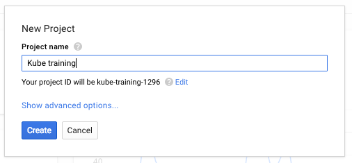
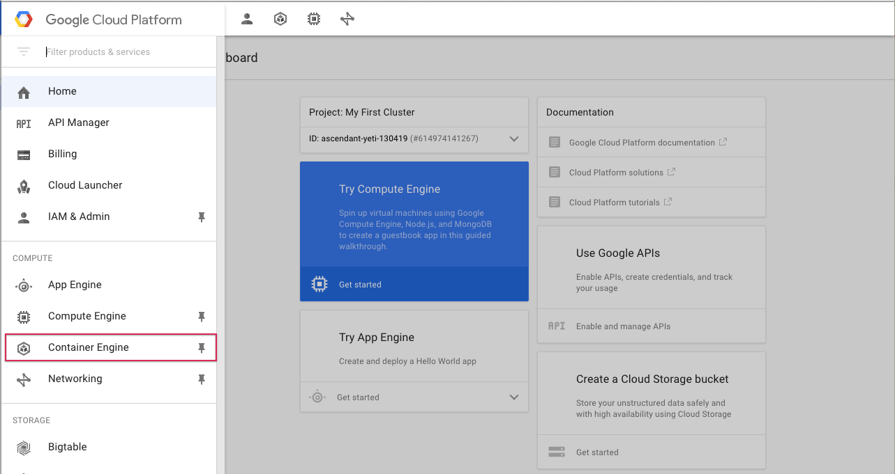
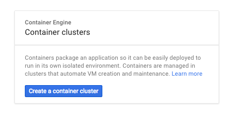
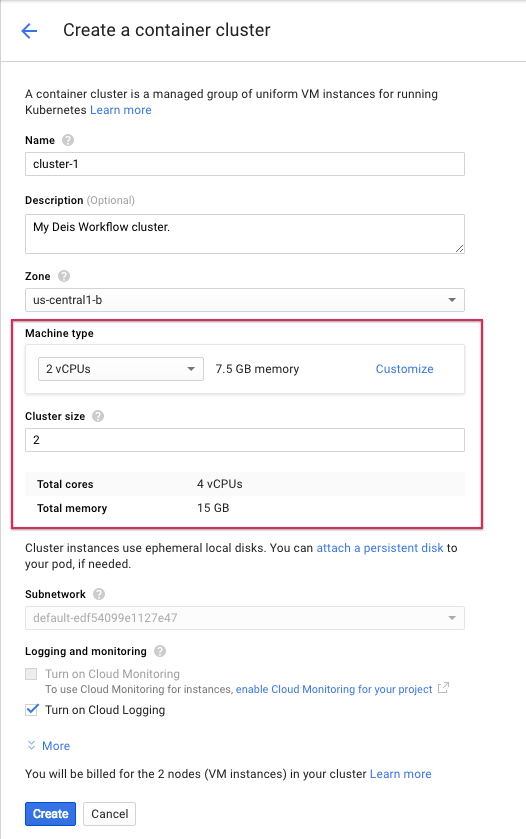
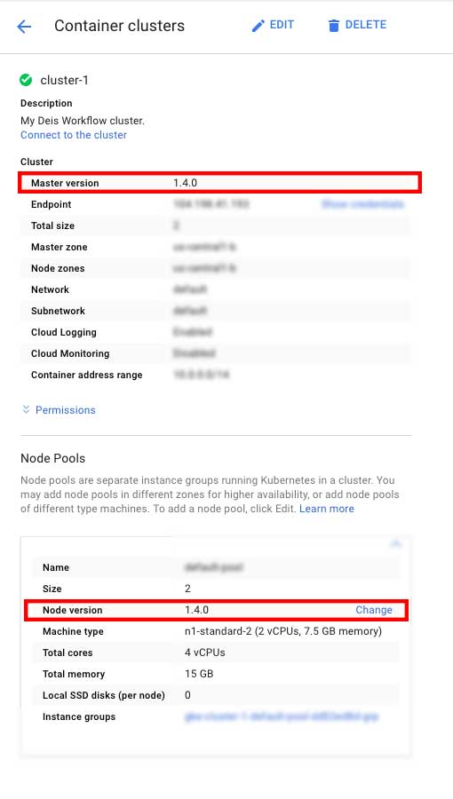

# Booting Kubernetes on Google Container Engine

Google Container Engine (GKE) is a managed Kubernetes environment which is great for hosting Deis Workflow. Google Container Engine manages the Kubernetes master and you pay for the compute nodes. Clusters smaller than five nodes are charged only for the compute. Clusters six nodes are larger cost $0.15/hour per cluster.

If you do not already have a Google Cloud account, you can start a trial with $300 of free credit [here](https://goo.gl/ysYyZK). After completing sign up, you must add your billing information.

## Create Your Google Cloud Project

Sign in to your [Google Cloud Platform Console](https://console.cloud.google.com) and create a new project:


Pick a project name. A project groups resources together and can hold more than one container cluster:



Note the project ID. This is a unique name across all Google Cloud projects. Later, we will refer to this as `PROJECT_ID`.

Next, [enable billing](https://console.cloud.google.com/billing) in the console. Next, enable the [Container Engine API](https://console.cloud.google.com/apis/api/container/overview) and [Compute Engine API](https://console.cloud.google.com/apis/api/compute_component/overview). You must complete *all three* steps before continuing.

## Create Your GKE Cluster

From the navigation hamburger in the upper left corner, find and select **Container Engine**:



Select **Create Container Cluster**:



For development and testing, we recommend you use the `n1-standard-2` machine type which has 2 VCPUs and 7.5 GB of RAM per server, and a cluster size of at least 2:



Click "Create" and Google Container Engine will provision your cluster. The process will take a few minutes to complete.

## Check Kubernetes version

]

After the cluster is created, check the node version. See [Kubernetes Versions](https://deis.com/docs/workflow/installing-workflow/system-requirements/#kubernetes-versions) under System Requirements for more details.

## Install and configure the Google Cloud CLI

While your container cluster is booting. You will need to install the Google Cloud CLI tools. We will use the tools to fetch cluster credentials to authenitcate to your new Kubernetes cluster.

Google maintains a number of [quickstart guides](https://cloud.google.com/sdk/docs/) which walk you through the installation.

Once you have installed the CLI tooling set your default project and list your container clusters:

```
$ gcloud projects list
PROJECT_ID             NAME               PROJECT_NUMBER
ascendant-yeti-130419  My First Cluster   614974141267
```

Set your default project:

```
$ gcloud config set project ascendant-yeti-130419
```

Then list your container clusters:
```
$ gcloud container clusters list
NAME       ZONE           MASTER_VERSION  MASTER_IP        MACHINE_TYPE   NODE_VERSION  NUM_NODES  STATUS
cluster-1  us-central1-b  1.2.4           104.154.234.246  n1-standard-2  1.2.3 *       2          RUNNING
```

If you haven't configured your default zone, make sure it matches the ZONE for your cluster:
```
$ gcloud config set compute/zone us-central1-b
```

Now you may fetch Kubernetes credentials:
```
$ gcloud container clusters get-credentials cluster-1
Fetching cluster endpoint and auth data.
kubeconfig entry generated for cluster-1.
```

Your local `kubectl` utility should now be pointed at your new container cluster. You can verify your crednentials and local configuration by running:

```
$ kubectl cluster-info
Kubernetes master is running at https://104.154.234.246
GLBCDefaultBackend is running at https://104.154.234.246/api/v1/proxy/namespaces/kube-system/services/default-http-backend
Heapster is running at https://104.154.234.246/api/v1/proxy/namespaces/kube-system/services/heapster
KubeDNS is running at https://104.154.234.246/api/v1/proxy/namespaces/kube-system/services/kube-dns
kubernetes-dashboard is running at https://104.154.234.246/api/v1/proxy/namespaces/kube-system/services/kubernetes-dashboard
```

You are now ready to [install Deis Workflow](install-gke.md)

